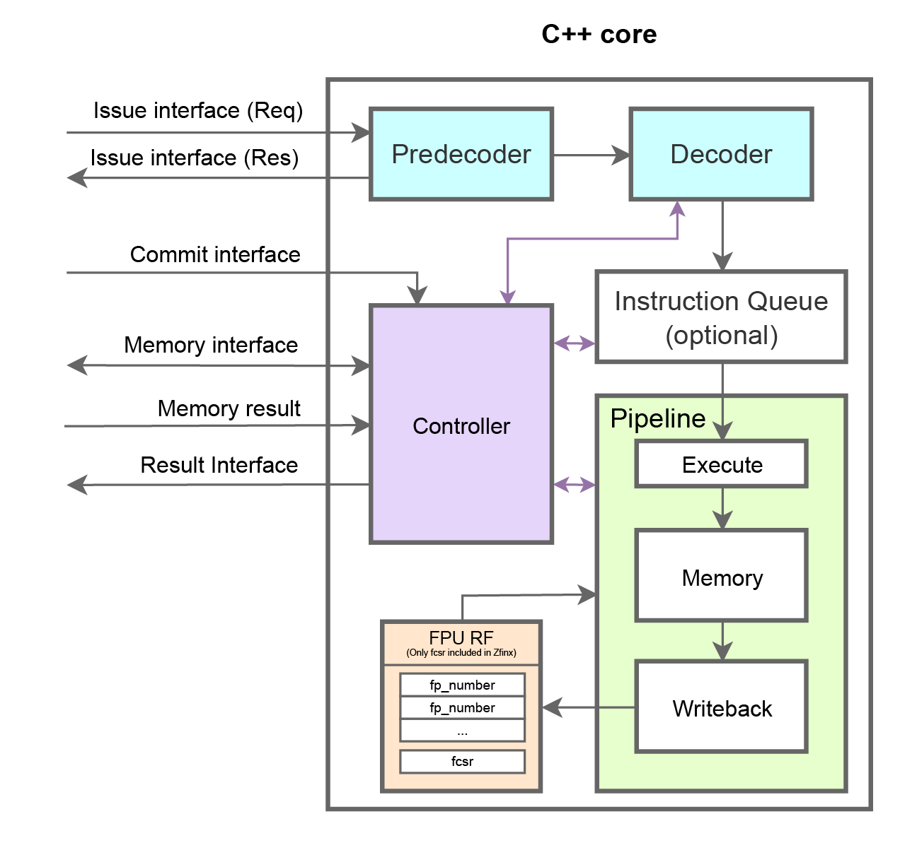

# RISC-V Floating-point Coprocessor Model (rvfpm)
The RISC-V Floating-point Coprocessor Model (rvfpm) is a customizable model for verification, design exploration and performance modeling. It provides an easy to configure model, supporting the RISC-V "F" and "Zfinx" extensions, a variety of pipeline structures and optimizations using the eXtension Interface for ease of integration.

## Status
Compiled, tested and verified on x86_64 using GCC 12.0.0. Ibex verification done in [Ibex fork](https://github.com/AndreasBakke/rvfpm_ibex_testing).
|Extension|Status| Comment |
|---|---|---|
|"F"|Implemented. 100% compliance using Berkeley Testfloat| Default extension.|
|"Zfinx"| Implemented. | Verified functionally using Ibex. |
|"D", "Q" |In progress.| Branch "precisions"|
|"Zfh", "Zfhmin"| In progress.| Branch "precisions"|
|"Zfa"|Not started.||
|"bfloat"|Not started.||

## Structure
### Core

All files relevant to the C++ core and its verification can be found in work/. Header files are located in work/include and need to be included during compilation. See the Makefile in work/ for details. C++ files are locateed in work/src.

### Interface
The RISC-V Floating-point Coprocessor Model implements all but the compressed interface of the eXtension Interface. 

### Compliance testing
The interface for Berkeley TestFloat can be found alongside the C++ core files in work/src. Note that conversion functions to/from hex-strings are generated by chatGPT.

### Functional verification
The testbench used for functional verification can be found in its entirity in work/sim.

## Testing
All compiled binaries for testing and verification are located in work/bin.

### Compliance
To test for IEEE754 compliance run make TestFloat from work/
- Results is written to work/tests/\<target\>/rm-\<rounding mode\>/\<test\>.txt

### Functional verification
For functional verification run make sim_full from work/
- Verification has been done using QuestaSim, adapt the Makefile in work/ if another toolset is used.

## Status
Currently only supports the F-Extension.

Compiled and tested for compliance using Apple Arm - Apple clang version 15.0

Compiled, tested for compliance and simulated using x86_64 - GCC 12.2.0 and QuestaSim 2020

For other architectures, adapt flags in work/Makefile
